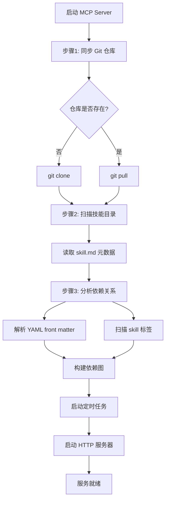
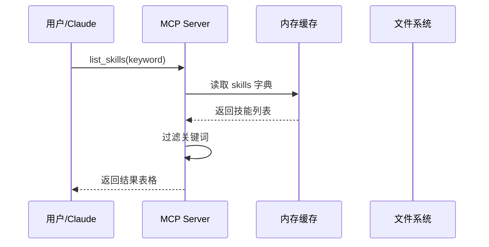
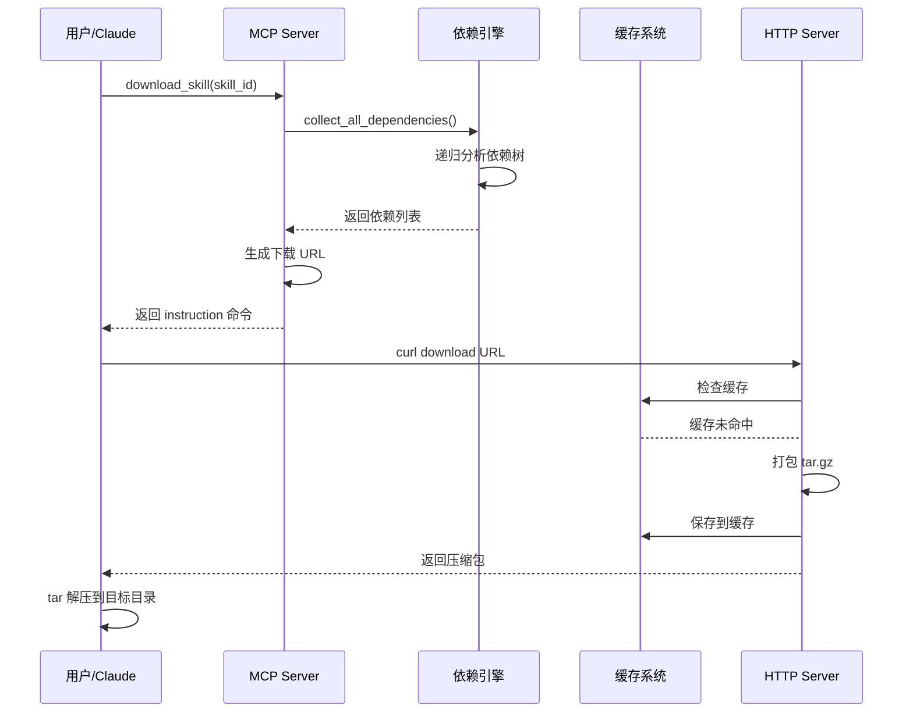
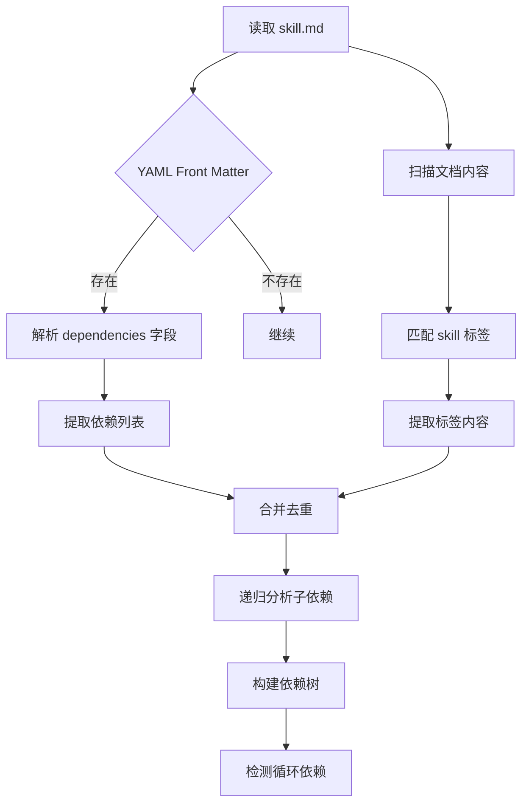

# 基于MCP自动化中心化管理skills

## 📚 目录

- [项目概述](#项目概述)
- [架构设计](#架构设计)
- [环境要求](#环境要求)
- [安装部署](#安装部署)
- [配置说明](#配置说明)
- [功能详解](#功能详解)
- [使用指南](#使用指南)
- [API接口](#api接口)
- [工作流程](#工作流程)
- [依赖管理](#依赖管理)
- [常见问题](#常见问题)

---

## 项目概述

### 1.1 项目背景

MCP Skill Manager 是一个基于 **Model Context Protocol (MCP)** 的技能管理服务器，旨在为 Claude Code 和其他 AI 工具提供统一的技能包管理能力，为解决skill管理紊乱场景而设计。

### 1.2 核心目标

- **统一管理**：集中管理所有 AI 技能包，便于版本控制和分发
- **依赖解析**：自动分析和处理技能之间的依赖关系（类似 Maven/npm）
- **快速分发**：通过 HTTP 服务快速下载技能包及其依赖
- **自动同步**：定期同步 Git 仓库，保持技能包最新状态
- **标准协议**：基于 MCP 协议，可与任何支持 MCP 的工具集成

### 1.3 主要特性

- ✅ 技能列表查询（支持关键词搜索）
- ✅ 技能详情查看（包含文件统计、依赖树）
- ✅ 智能依赖管理（自动收集传递依赖）
- ✅ 一键下载安装（支持单个或全部技能）
- ✅ 缓存机制（加速重复下载）
- ✅ 定时同步（每小时自动更新仓库）
- ✅ 循环依赖检测

---

## 架构设计

### 2.1 系统架构

```
┌─────────────────────────────────────────────────────────────┐
│                      Claude Code / Codex AI Tools           │
│                         (MCP Client)                        │
└──────────────────────────┬──────────────────────────────────┘
                           │ MCP｜HTTP Protocol
                           ↓
┌─────────────────────────────────────────────────────────────┐
│                    MCP Skill Manager Server                 │
├─────────────────────────────────────────────────────────────┤
│  ┌────────────────┐           ┌─────────────────┐           │
│  │  FastMCP       │           │   FastAPI       │           │
│  │  (MCP Tools)   │           │   (HTTP Server) │           │
│  └────────────────┘           └─────────────────┘           │
│         │                              │                    │
│         ↓                              ↓                    │
│  ┌────────────────────────────────────────────┐             │
│  │         Skill Management Core              │             │
│  │  - list_skills()                           │             │
│  │  - get_skill_info()                        │             │
│  │  - download_skill()                        │             │
│  │  - clear_cache()                           │             │
│  └────────────────────────────────────────────┘             │
│         │                                                   │
│         ↓                                                   │
│  ┌────────────────────────────────────────────┐             │
│  │      Dependency Analysis Engine            │             │
│  │  - analyze_skill_dependencies()            │             │
│  │  - build_dependency_tree()                 │             │
│  │  - collect_all_dependencies()              │             │
│  └────────────────────────────────────────────┘             │
│         │                                                   │
│         ↓                                                   │
│  ┌────────────────────────────────────────────┐             │
│  │         Background Scheduler               │             │
│  │  - Git sync (hourly)                       │             │
│  │  - Dependency update                       │             │
│  └────────────────────────────────────────────┘             │
└──────────────────────────┬──────────────────────────────────┘
                           │ Git Operations
                           ↓
┌─────────────────────────────────────────────────────────────┐
│                  Git Repository (Skills)                    │
└─────────────────────────────────────────────────────────────┘
```

### 2.2 核心组件

| 组件 | 技术栈 | 职责 |
|------|--------|------|
| **MCP Server** | FastMCP | 提供 MCP 协议的工具接口 |
| **HTTP Server** | FastAPI + Uvicorn | 提供文件下载服务 |
| **Dependency Engine** | Python | 分析和解析技能依赖关系 |
| **Scheduler** | APScheduler | 定时任务（Git 同步） |
| **Cache Manager** | File System | 管理压缩包缓存 |

### 2.3 数据流

```
User Request → MCP Client → MCP Server → Skill Analysis → Git Repo
                                ↓
                          Dependency Tree
                                ↓
                          Package Skills
                                ↓
                         Cache (.tar.gz)
                                ↓
                        HTTP Download URL
                                ↓
                          User Downloads
```

---

## 环境要求

### 3.1 系统要求

- Python 3.10+
- Git 2.0+
- 操作系统：macOS / Linux / Windows

### 3.2 依赖包

```txt
fastapi       # Web 框架
uvicorn       # ASGI 服务器
fastmcp       # MCP 协议实现
apscheduler   # 定时任务
```

---

## 安装部署
```markdown
本文档使用完整的源码部署，可以统一部署到远程服务器，本地AI客户端直接使用mcp服务即可， 还可使用打包好的mcp_server程序包直接运行，无需依赖各种环境
```


### 4.1 克隆项目

准备项目环境

### 4.2 创建虚拟环境

```bash
python3 -m venv .venv
source .venv/bin/activate  # macOS/Linux
# .venv\Scripts\activate    # Windows
```

### 4.3 安装依赖

```bash
pip install -r requirements.txt
```

### 4.4 配置 Git SSH Key

确保已配置 Git SSH Key，能够访问技能仓库：

```bash
ssh -T git@github..com
```

### 4.5 启动服务器

```bash
python mcp_server.py
```

启动后，服务器将：
1. 自动同步 skills 仓库
2. 加载所有技能信息
3. 分析依赖关系
4. 启动定时任务（每小时同步）

---

## 配置说明

### 5.1 核心配置

在 `mcp_server.py` 中修改以下配置：

```python
# Git 仓库地址
REPO_URL = "git@gihub.com:xxx/skills.git"

# 本地存储目录
LOCAL_DIR = os.path.join(BASE_DIR, "skills")

# 缓存目录
CACHE_DIR = os.path.join(LOCAL_DIR, ".skill-cache")

# HTTP 服务地址
SKILL_FILE_BASE_URL = "http://localhost:8002"

# 服务端口
PORT = 8002
```

### 5.2 mcp client 配置
#### 5.2.1 claude code
```bash
claude mcp add --transport http skill-manager http://localhost:8002/ai/mcp
```
重启claude code

#### 5.2.2 codex
```bash
cd ~/.codex
vi config.toml
```
在配置文件新增：
```toml
[mcp_servers.skill-manager]
type="http"
url="http://localhost:8002/ai/mcp"
```
重启codex cli

---

## 功能详解

### 6.1 技能列表查询

**功能**：列出所有可用技能，支持关键词搜索

**MCP Tool**：`list_skills(keyword: str = "")`

**示例**：

```python
# 列出所有技能
result = list_skills()

# 搜索包含 "xx" 的技能
result = list_skills(keyword="xx")
```

**返回结构**：

```json
{
  "status": "success",
  "count": 25,
  "data": {
    "xx-infra-stack": {
      "id": "infra-stack",
      "name": "Infrastructure Stack",
      "description": "基础设施技术栈规范",
      "dependencies": ["writing-plans", "executing-plans"]
    },
    ...
  }
}
```


### 6.2 技能详情查看

**功能**：查看单个技能的详细信息，包括文件统计、依赖树

**MCP Tool**：`get_skill_info(skill_id: str)`

**示例**：

```python
result = get_skill_info(skill_id="xx-infra-stack")
```

**返回结构**：

```json
{
  "status": "success",
  "data": {
    "id": "infra-stack",
    "name": "Infrastructure Stack",
    "description": "基础设施技术栈规范",
    "file_count": 8,
    "total_size_kb": 124.5,
    "direct_dependencies": ["writing-plans", "executing-plans"],
    "direct_dependencies_count": 2,
    "dependency_tree": {
      "skill_id": "infra-stack",
      "exists": true,
      "dependencies": [...]
    },
    "dependency_tree_text": "infra-stack\n├── writing-plans\n└── executing-plans"
  }
}
```

### 6.3 技能下载

**功能**：下载技能包及其所有依赖（类似 Maven）

**MCP Tool**：`download_skill(skill_id: str, download_all: bool, install_dir: str)`

**示例**：

```python
# 下载单个技能（含依赖）
result = download_skill(
    skill_id="infra-stack",
    install_dir="~/.claude/skills"
)

# 下载所有技能
result = download_skill(
    download_all=True,
    install_dir="~/.claude/skills"
)
```

**返回结构**：

```json
{
  "status": "success",
  "skill_id": "infra-stack",
  "dependencies": ["writing-plans", "executing-plans"],
  "total_skills": 3,
  "download_url": "http://localhost:8002/download/infra-stack-with-deps",
  "size_kb": 256.8,
  "install_dir": "~/.claude/skills",
  "instruction": "mkdir -p ~/.claude/skills && curl -o ~/.claude/skills/infra-stack.tar.gz http://localhost:8002/download/infra-stack-with-deps && tar -xkzf ~/.claude/skills/infra-stack.tar.gz -C ~/.claude/skills/ && rm ~/.claude/skills/infra-stack.tar.gz"
}
```

**执行下载**（根据返回的 `instruction` 字段）：

```bash
mkdir -p ~/.claude/skills && \
  curl -o ~/.claude/skills/infra-stack.tar.gz http://localhost:8002/download/infra-stack-with-deps && \
  tar -xkzf ~/.claude/skills/infra-stack.tar.gz -C ~/.claude/skills/ && \
  rm ~/.claude/skills/infra-stack.tar.gz
```

### 6.4 缓存清理

**功能**：清理压缩包缓存，强制重新生成

**MCP Tool**：`clear_skill_cache()`

**示例**：

```python
result = clear_skill_cache()
```

---

## 使用指南

### 7.1 在 Claude Code 中使用

#### Step 1: 启动 MCP Server

```bash
python mcp_server.py
```

#### Step 2: 查询可用技能

在 Claude Code 中输入：

```
请列出所有可用的 skills
```

Claude 会调用 `list_skills()` 并展示结果表格。

#### Step 3: 查看技能详情

```
请查看 xx-infra-stack 这个 skill 的详细信息
```

Claude 会调用 `get_skill_info()` 并展示：
- 文件数量和大小
- 直接依赖列表
- 完整依赖树

#### Step 4: 下载安装技能

```
请下载 xx-infra-stack 技能到 ~/.claude/skills
```

Claude 会：
1. 调用 `download_skill()` 获取下载指令
2. 执行 curl + tar 命令完成下载和解压
3. 确认安装成功

### 7.2 通过 HTTP API 直接下载

#### 下载单个技能（含依赖）

```bash
curl -o skill.tar.gz http://localhost:8002/download/infra-stack-with-deps
tar -xkzf skill.tar.gz -C ~/.claude/skills/
```

#### 下载所有技能

```bash
curl -o all-skills.tar.gz http://localhost:8002/download/all
tar -xkzf all-skills.tar.gz -C ~/.claude/skills/
```

---

## API 接口

### 8.1 MCP Tools

| Tool Name | Parameters | Description |
|-----------|------------|-------------|
| `list_skills` | `keyword: str` | 列出所有技能，支持搜索 |
| `get_skill_info` | `skill_id: str` | 获取技能详情 |
| `download_skill` | `skill_id: str`<br>`download_all: bool`<br>`install_dir: str` | 获取下载信息 |
| `clear_skill_cache` | 无 | 清理缓存 |

### 8.2 HTTP Endpoints

| Method | Path | Description |
|--------|------|-------------|
| GET | `/download/{skill_id}` | 下载单个技能（不含依赖） |
| GET | `/download/{skill_id}-with-deps` | 下载技能及所有依赖 |
| GET | `/download/all` | 下载所有技能 |
| * | `/ai/mcp` | MCP 协议端点 |

---

## 工作流程

### 9.1 启动流程



### 9.2 查询技能流程



### 9.3 下载技能流程



### 9.4 依赖解析流程



---

## 依赖管理

### 10.1 依赖声明方式

#### 方式1：YAML Front Matter

在 `skill.md` 文件头部声明：

```markdown
---
name: devops-flow
description: DevOps 流程规范
dependencies: ['writing-plans', 'executing-plans']
---

# Skill 内容...
```

#### 方式2：Skill 标签

在文档内容中引用：

```markdown
本技能依赖 <skill>writing-plans</skill> 和 <skill>executing-plans</skill>。
```

### 10.2 依赖树示例

```
devops-flow
├── writing-plans
│   └── brainstorming
└── executing-plans
    ├── infra-stack
    │   └── java-code-style
    └── commit-and-deploy
```

### 10.3 循环依赖检测

系统会自动检测并标记循环依赖：

```
skillA
├── skillB
│   └── skillC
│       └── skillA [循环依赖]
```

### 10.4 传递依赖收集

下载 `devops-flow` 时，会自动下载：
- `devops-flow` (主技能)
- `writing-plans` (直接依赖)
- `brainstorming` (传递依赖)
- `executing-plans` (直接依赖)
- `infra-stack` (传递依赖)
- `java-code-style` (传递依赖)
- `commit-and-deploy` (传递依赖)

---

## 常见问题

### Q1: MCP Server 无法启动

**问题**：启动时报错 `Git clone failed`

**解决**：
1. 检查 SSH Key 配置：`ssh -T git@github.com`
2. 确认仓库地址正确：检查 `REPO_URL` 配置
3. 手动克隆测试：`git clone git@github.com:xxx/skills.git`

### Q2: Claude Code 无法连接 MCP Server

**问题**：Claude 提示无法使用 skill-manager 工具

**解决**：
1. 确认 MCP Server 正在运行：`curl http://localhost:8002/ai/mcp`
2. 检查 Claude 配置文件：`~/.claude/mcp_server_config.json`
3. 重启 Claude Code

### Q3: 下载的技能无法使用

**问题**：技能已下载到 `~/.claude/skills`，但 Claude 无法识别

**解决**：
1. 检查解压路径：`ls ~/.claude/skills/`
2. 确认目录结构：每个技能应有独立文件夹
3. 检查 skill.md 文件是否存在
4. 重启 Claude Code 重新加载技能

### Q4: 依赖未自动下载

**问题**：只下载了主技能，依赖未下载

**解决**：
1. 确认使用的是 `-with-deps` 端点
2. 检查依赖声明是否正确（skill.md 格式）
3. 查看服务器日志，确认依赖分析成功
4. 清理缓存后重试：调用 `clear_skill_cache()`

### Q5: 如何更新技能到最新版本

**解决**：
1. 等待定时任务自动同步（每小时）
2. 或重启 MCP Server 触发同步
3. 清理缓存：`clear_skill_cache()`
4. 重新下载技能

### Q6: 如何添加新的技能

**步骤**：
1. 在 Git 仓库创建新文件夹（技能 ID）
2. 添加 `skill.md` 文件，格式如下：

```markdown
---
name: my-new-skill
description: 这是一个新技能
dependencies: []
---

# My New Skill

技能内容...
```

3. 提交并推送到仓库
4. 等待 MCP Server 自动同步，或重启服务器

---

## 附录

### A1. skill.md 模板

```markdown
---
name: skill-name
description: 技能描述（一句话说明用途）
dependencies: ['dependency1', 'dependency2']
---

# Skill Name

## 概述

技能的详细说明...

## 使用场景

- 场景1
- 场景2依赖<skill>skillA</skill>

## 示例

具体使用示例...
```

### A2. 目录结构

```
skill-manager/
├── mcp_server.py           # 主服务器脚本
├── requirements.txt        # Python 依赖
├── README.md               # 项目说明
└── skills/                 # 技能仓库（Git clone）
    ├── .git/
    ├── .skill-cache/       # 压缩包缓存
    ├── infra-stack/
    │   └── skill.md
    ├── writing-plans/
    │   └── skill.md
    └── ...
```

### A3. 性能优化建议

1. **缓存策略**：压缩包生成后会缓存，无需重复打包
2. **并发下载**：HTTP Server 支持并发请求
3. **增量同步**：Git pull 仅拉取更新内容
4. **依赖剪枝**：避免重复打包相同依赖

### A4. 安全建议

1. **仅内网访问**：建议仅在内网环境部署
2. **SSH Key 保护**：妥善保管 Git SSH Key
3. **端口防火墙**：限制 8002 端口访问范围
4. **日志审计**：定期检查下载日志

---

## 联系方式

如有问题，请联系：
- 邮箱：long2900645253@163.com

---
